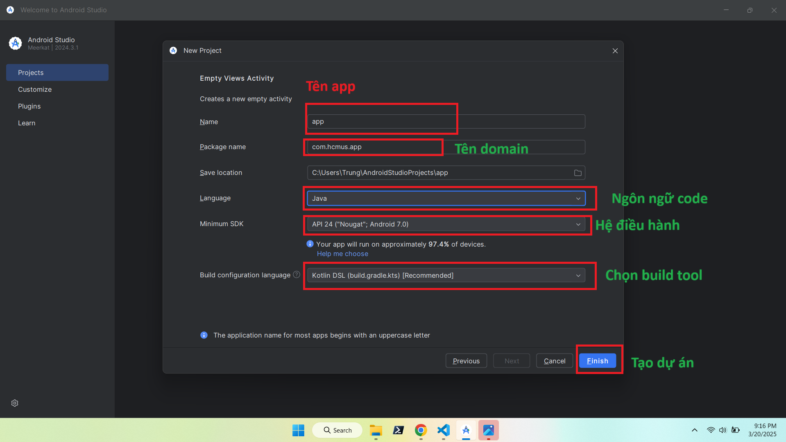
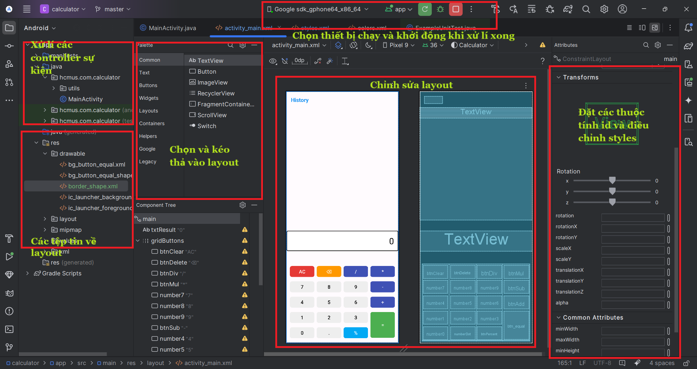
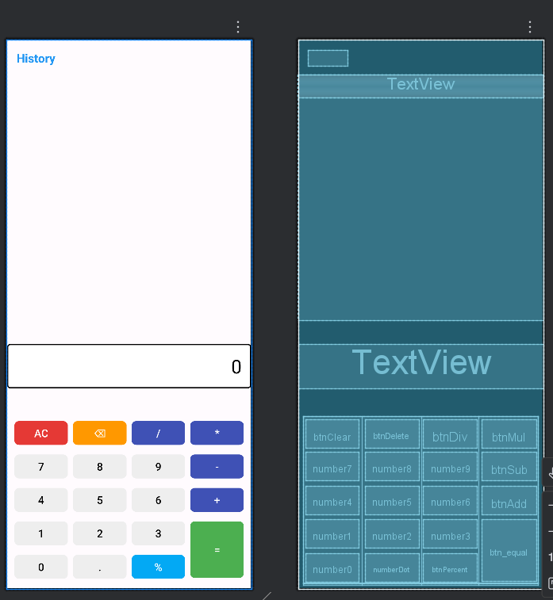

# 📱 Android App: Ứng dụng Android tính toán cơ bản

Ứng dụng Android sử dụng các tính năng cơ bản để thực hiện tính toán các logic cơ bản

---
## 🎬 Chương trình ứng dụng và kiểm thử

---

##  🎬 Xem tại Youtube
[](https://youtube.com/shorts/ttnRgQCgkKQ)


---

## 🚀 1. Tạo Project mới trong Android Studio
Tạo một dự án mới trong **Android Studio**:


---

## 🏗️ 2. Chọn loại Activity
Chọn **Basic View Activity** để có giao diện cơ bản:


---

## ✏️ 3. Đặt tên project và chọn cấu hình Android
Nhập tên ứng dụng, package name, và chọn ngôn ngữ **Java/Kotlin**:


---

## 🖥️ 4. Màn hình chính trong Android Studio
Khi mở dự án, bạn sẽ thấy giao diện chính gồm **XML Layouts** và **MainActivity**:


---

## 🎨 5. Thiết kế giao diện (Layout)

### 🔹 Main Activity
Màn hình chính giới thiệu thông tin ứng dụng và các tính năng được tích hợp

---

## ⚙️ 6. Cách hoạt động
   Ứng dụng thực hiện các tính toán cơ bản giúp người dùng có thể xử lí các tính toán một cách dễ dàng
---
## 🛠️ 7. Cách chạy ứng dụng

1. Clone repo này về máy:
   ```sh
   git clone https://github.com/Trung78z/AndroidPractice2Calculator.git
   ```
2. Mở **Android Studio** và import project.
3. Chạy ứng dụng trên **Emulator** hoặc **thiết bị thật**.


---

## 📩 8. Liên hệ
Nếu có thắc mắc hoặc góp ý, vui lòng liên hệ qua email: `trungpspy@gmail.com`.